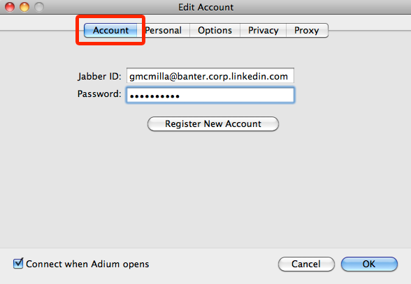
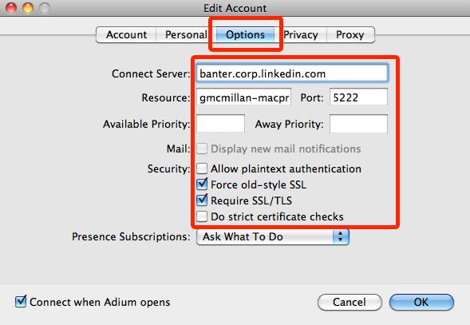

The Company uses Jabber as an Instant Messaging (IM) and presence protocol. 

For Mac users, IT supports the Adium IM client.

# Adium Account Setup

Follow these steps to set up an Adium account:

**Step 1** – Start Adium

**Step 2** – Go to **File** > **Add Account** > **Jabber**

Depending on your version, Jabber might not appear in the list. Instead, choose XMPP.

**Step 3** – For the Jabber ID, enter your Company AD username @foo.corp.company.com. For the password, use your Company AD password:

**Step 4** – Go to the Options tab and configure these settings:

* For Connect to Server, enter foo.corp.company.com
* Check "Force old-style SSL"
* Check "Require SSL/TLS"
* UNCHECK "Do strict certificate checks" (this is ok since service is run on the internal network)

Step 5 – Click **OK**